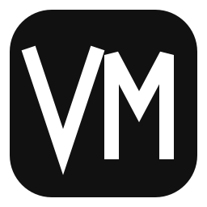

<!-- readme-header:start -->

<p align="center">
  
</p>

<h1 align="center">Visual Multimedia</h1>

<p align="center">
  <strong>確認済みの内容や既存素材を、あとから編集でき、プレビューと書き出しができる画像・動画・音声に仕上げます。</strong>
</p>

<p align="center">
  <a href="./README.md">中文</a> · <a href="./README.en.md">English</a> · <strong>日本語</strong> | <a href="./SKILL.md">文档</a> | <a href="./CONTRIBUTING.md">贡献</a> | <a href="https://github.com/CheshireMew/visual-multimedia/issues">反馈</a>
</p>

<p align="center">
  <a href="https://x.com/0xCheshire" title="X"></a>
  <a href="https://t.me/CheshireBTC" title="Telegram"></a>
  <a href="https://blog.blacknico.com/" title="Blog"></a>
  <a href="https://blacknico.com/" title="Homepage"></a>
</p>

<p align="center">
  <a href="https://github.com/CheshireMew/visual-multimedia/stargazers"></a>
  <a href="https://github.com/CheshireMew/visual-multimedia/forks"></a>
  <a href="https://github.com/CheshireMew/visual-multimedia/blob/main/LICENSE"></a>
</p>

<!-- readme-header:end -->

Visual Multimedia はメディア制作の Agent Skill です。技術図解、Web アニメーション、動画、音声番組、ポッドキャストから適切な媒体を選び、その媒体に必要なタイトル、ナレーション、字幕、番組構成、付随テキストまで扱います。単独の静止カード、ソーシャルカード、文字カード、カルーセル、単独カバーの制作機能は終了しており、それらを自動的にアニメーションや動画へ置き換えることもありません。プレビュー、レンダリング、レビュー、納品の全工程では、編集可能な真源を一つだけ維持します。


<p align="center"><sub>実際の編集可能 Web ケース：内容、構図、時間、書き出したプレビューは同じ活動中の真源から生成されています。</sub></p>

未確認のテーマを調査する、事実を作る、長い資料から重要部分を選ぶ、撮影を計画する、ユーザーに代わって公開する、といった作業は対象外です。制作を始める前に、確認済みの内容真源が必要です。

## クイックスタート

Agent Skill に対応した Agent でこのリポジトリを読み込み、`$visual-multimedia` を指定して、確認済みの内容または素材、対象読者、必要な成果物を伝えます。

```text
$visual-multimedia を使って、承認済みのシステム説明を編集可能な技術図解にしてください。
ノード、インターフェース、データフローの関係を保ち、文書用 PNG も書き出してください。
```

```text
$visual-multimedia を使って、このインタビューと確認済み字幕を 90 秒の動画にしてください。
出演者の原音を残し、先に使用区間とナレーション案を提示してください。
```

```text
$visual-multimedia を使って、完成済みの説明原稿を、手動送りと連続書き出しの両方に対応する
複数シーンの HTML アニメーションにしてください。
```

Skill だけが指定され、サンプルか完成品かが明示されていない場合は、最適な媒体を一つ提案し、確認可能なメディア文案を作ったところで判断を待ちます。ファイル作成、外部サービス、最終書き出しは、依頼範囲で許可された場合にのみ実行します。

確認回数を減らすには、内容真源、読者に理解してほしいこと、寸法・長さ・形式、使用可能な素材、外部ツール・ダウンロード・有料生成の可否を最初に伝えてください。

## 制作できるもの

| 目的 | 主な入力 | 確認できる成果 |
| --- | --- | --- |
| 技術比較図、システム図 | 確認済み概念、関係、ビジュアル方針 | 読みやすい静止図、または全体構造を固定した動的図解と状態確認画像 |
| GIF、動く図解、コードアニメーション | 意味上の手順、再生方法 | 時刻を一意に指定できる Web タイムラインと、指定 GIF または動画 |
| 説明用 B-roll と動画パッケージ | 完成済みナレーション、内容関係、比率、実音声の時間 | 選択済みテンプレート、タイムライン用素材、PNG・GIF・動画・透過出力 |
| 複数シーン HTML | 完成文案、シーン順、手動・自動・混合再生条件 | 同じ Web 真源によるインタラクティブ表示と連続書き出し |
| インタビュー、講義、画面収録、実写の編集 | 原素材、確認済み文字起こし、使用区間、納品条件 | 編集可能タイムライン、字幕、ミックス、レビュー証拠、完成メディア |
| 音声、ポッドキャスト | 録音、番組構成、ナレーション、音響条件 | 音声タイムライン、ミックス、必要な付属ファイル |
| 参照動画への一致 | 正確な参照区間、対象素材、再現レベル | 完全再生またはパラメータ再構築を分離した成果と、フレーム・視聴証拠 |
| アニメ調プレゼンター | 登録済みキャラクター、または承認済み母版・校正動画、実音声 | バージョン管理されたキャラクター素材、確認済み時間軸、全身トラックまたは固定窓 |
| インタビュー原音の解説動画 | 選択済み原音、事実文字起こし、背景、解説 | 出典タイムコード付きの「背景→原音→解説→結論」動画と納品レポート |
| GitHub プロジェクト紹介動画 | 確認済みのリポジトリ事実、一つの中心主張、UI・端末・文書・実出力のいずれかの証拠 | 銀狼音声 1.25 倍速と中国語・英語字幕を標準とする約 1 分の横動画、および追跡可能なビルド・レビュー・納品レポート |
| メディア文案と話し方の参照庫 | 確認済みの主張と書き手の声、または明示的な参照庫保守依頼 | そのまま制作に使える活動文案、または Skill 外部の追跡可能な参照庫 |

タスクの振り分け、必要な reference、停止条件は [SKILL.md](SKILL.md) を参照してください。

## 実際の出力例

<table>
  <tr>
    <td width="50%" valign="top">
      
      <br><sub>仕組みの比較：各列の小さなフロー図と共通能力境界で違いを説明。</sub>
    </td>
    <td width="50%" valign="top">
      
      <br><sub>全体固定アニメーション：構造を変えず、同色の動きで意味上のイベントを順に示します。</sub>
    </td>
  </tr>
</table>

## 制作モデル

1. 内容を確認してから媒体を選びます。映像と音は主張を分かりやすくしますが、第二の事実真源にはなりません。
2. 画面や音を作る前に媒体用文案を確定します。承認済み文案は媒体に必要な範囲でのみ分割します。
3. まだ確認されていない最初の層でサンプルを作ります。文案、スタイル、構図、動き、音を分けて確認します。
4. 成果物ごとに活動中の制作真源を一つだけ残します。Web は Web パッケージ、動画と音声は活動タイムラインへ戻して修正します。
5. 実際の利用側で検証します。schema やスクリプトの成功だけでは納品完了とせず、ブラウザ、プレーヤー、編集器、書き出しチェーンで確認します。

### 動画の実行プロバイダーを選ぶ

Skill は先に活動中の真源を確定し、その後で現在のマシンに実在する能力を検査します。選択結果は納品契約に記録され、実行時の失敗を理由に黙って別プロバイダーへ切り替えることはありません。

| プロバイダー | 使用条件 | 活動真源と納品 |
| --- | --- | --- |
| ローカル制作 | MediaFlow Pro が未設定、必要な能力が利用不可、またはユーザーがローカルでの独立制作を明示的に選んだ場合 | `editable-media` v6 または `media-timeline` v1 が編集可能な真源として残り、Web、MP4、GIF、既存素材編集、音声、字幕までローカルの正式ルートだけで完結できます |
| [MediaFlow Pro](https://github.com/CheshireMew/MediaFlow-Pro) | 設定済みで必要な操作が実測で利用可能な場合に既定で優先します。ネイティブ工程、デスクトップ調整、マルチトラック、版管理、受け渡しが必要な場合は特に適しています | 製品非依存の真源を読み込み、成功後は `project.mfp` が唯一の活動タイムラインとなり、同じ工程から書き出します |
| [HyperFrames](https://github.com/heygen-com/hyperframes) | 独立した無音のコード Web アニメーションについて、ユーザーが決定論的レンダリングを明示的に選んだ場合 | 同じ `editable-media` v6 の時間境界を読み、Web パッケージを真源として維持します。レンダー用コピーは派生物です |

プロバイダーの選択で変わるのは、決定論的処理の実行者と受け渡し方法だけです。内容、構造、スタイル、制作判断、最終確認は常に Skill が担当します。MediaFlow Pro は必須依存ではなく、HTML を使っているという理由だけで HyperFrames が選ばれることもありません。

### 編集真源と納品契約

- **Web パッケージ：** 技術指定がなければ [DOM starter](assets/web-media-starter) を使います。React が指定された場合、または入力自体が React である場合は、React 19、TypeScript 5.9、Vite 7 の決定論的プロデューサーである [React starter](assets/react-media-starter) を使います。どちらも自己完結型 editable-media v6 を生成し、React は MediaFlow Pro の状態や書き出しには入りません。
- **Web 契約：** `schemas/editable-media.v6.schema.json` が唯一のマニフェスト契約です。ローカルレンダラー、構造化編集器、HyperFrames は同じ `window.editableMedia` と `window.__hf.duration/seek(seconds)` を読みます。
- **媒体契約：** 画像、動画、音声、生成素材は、ハッシュ、出典、権利、原本とプロキシの関係を持つ素材台帳へ先に登録します。`media-timeline` v1 が可搬タイムラインを定義し、`media-delivery` v3 がプロバイダー、編集真源、レンダー記録、SHA-256 を最終出力へ結び付けます。
- **長期タスク：** `media-project-state.json` は制作段階、成果物ハッシュ、承認、決定、阻害要因、次の行動だけを記録し、編集器工程にはなりません。MediaFlow Pro に入った後の素材、タイムライン改訂、操作履歴は `project.mfp` だけに保存され、制作状態は関連契約と成果物だけを索引します。

## リポジトリ構成

| パス | 責務 |
| --- | --- |
| [SKILL.md](SKILL.md) | 適用範囲、標準フロー、タスク振り分け、納品基準 |
| [references](references) | 現在の媒体タスクに必要な場合だけ読む制作方法 |
| [assets](assets) | Web starter、実際の契約ケース、制作 profile、再利用資源 |
| [schemas](schemas) | 素材、タイムライン、レビュー、納品、キャラクター、編集 Web の契約 |
| [scripts](scripts) | 取り込み、検証、計画、レンダリング、レビュー、納品ツール |
| [agents/](agents/) | 任意の Agent ホスト向けアダプターメタデータ |
| [.project-steward/project.json](.project-steward/project.json) | リポジトリ運用管理の基準と版 |

`archive/` は廃止済みルートと移行証拠だけを保存します。活動制作が古いプロトコルや helper をここから復元することはありません。

## 保守と検証

変更した公開境界を覆う最小の検証段階を実行します。引数なしは `--fast` と同じです。

```powershell
node scripts/check-skill.mjs --fast
node scripts/check-skill.mjs --browser
node scripts/check-skill.mjs --full
```

`--fast` は Skill、README、ライセンス、schema、索引、実例の静的契約、構文を確認します。`--browser` は Playwright の Web パッケージ、決定論的時間、説明 B-roll、文字モーション、ローカル Web 動画、製品紹介動画を追加検証します。`--full` は GitHub プロジェクト紹介の非 GUI・編集可能 Web 証拠、二言語字幕、MediaFlow Pro 組み立てに加え、方向設計、可搬タイムライン、プロバイダー選択、Node・Python の媒体処理、レビュー、最終納品について、実際の生産者から消費者までを検証します。

editable-media、素材表現、決定論的時間、可搬タイムライン、納品契約、MediaFlow Pro 消費側を変更する場合は、すべての活動中の生産者と消費者を同時に移行します。正確なルールは [AGENTS.md](AGENTS.md)、MediaFlow Pro の公開操作は [references/structured-media-editor-cli.md](references/structured-media-editor-cli.md) を参照してください。

## 対象外

- 単独の静止カード、ソーシャルカード、文字カード、カルーセル、単独カバーの企画、制作、修正、書き出し。
- テーマの調査や、長い資料から重要部分を決めること。
- 単独で成立する長文、ニュースレター、短文投稿、スレッドの執筆。
- 現場撮影、スタッフ、機材、撮影日の計画。
- PowerPoint、Keynote などのスライドファイル作成。
- アカウント運用、日程設定、アップロード、送信、公開。

上流で確認済み内容を作成する能力、または完成後の公開フローと組み合わせてください。

## Star History

<picture>
  <source media="(prefers-color-scheme: dark)" srcset="https://raw.githubusercontent.com/CheshireMew/visual-multimedia/star-history/star-history-dark.svg">
  <source media="(prefers-color-scheme: light)" srcset="https://raw.githubusercontent.com/CheshireMew/visual-multimedia/star-history/star-history.svg">
  
</picture>

## ライセンス

オリジナルのソースコード、Skill、スクリプト、schema、テンプレート、文書は [Mozilla Public License 2.0](LICENSE) で提供されます。個人アバター、キャラクター、ブランド素材、プロジェクトが所有または生成した画像・音声・動画・レンダー・プレビュー媒体は MPL-2.0 の対象外であり、[ASSET-LICENSE](ASSET-LICENSE) に従って権利が留保されます。第三者素材にはそれぞれの条件が適用されます。

React starter の直接依存、正確なバージョン、ライセンスは [third-party notices](assets/react-media-starter/THIRD_PARTY_NOTICES.md) に記録され、封印された各ビルドにも同じ通知が含まれます。この starter には Remotion のソース、Composition、Renderer、その他の Remotion 実行コンポーネントは含まれていません。

パスごとの適用範囲、除外、第三者資源の扱いは [LICENSING.md](LICENSING.md) が正式な説明です。

## 第三者リソースと謝辞

- [Vincentwei1021/video-shotcraft](https://github.com/Vincentwei1021/video-shotcraft)：`assets/shot-recipe-library/recipes/` の 104 枚のショットカードと 161 個のスタイル変種の意味資料を、Apache-2.0 の上流、Copyright 2026 Wei Yihao から書き直しました。上流の Remotion TSX、製品画面、音声、プレビュー MP4、Gallery 実装は複製していません。[ショットレシピの通知](assets/shot-recipe-library/THIRD_PARTY_NOTICES.md)を参照してください。
- `sakura-animate-text`：`assets/text-motion-library/text-motion-runtime.js` の文字モーション群は、MIT License、Copyright 2026 Sakura のもとで決定論的に再実装しています。上流の WAAPI ループ、ランダム遅延、CDN ローダー、フレームワーク対応、サンプル文、フォント、サイトデザインは複製していません。[文字モーションの通知](assets/text-motion-library/THIRD_PARTY_NOTICES.md)を参照してください。
- [Xiaolai](https://github.com/lxgw/kose-font)：実際の手描き中国語ケースで `assets/web-card-cases/handdrawn-system-collaboration-flow/assets/fonts/Xiaolai-Regular.ttf` を使用しています。SIL Open Font License 1.1 の全文はフォントと同じ場所に保存されています。
- [Lucide](https://github.com/lucide-icons/lucide)：同じケースで Lucide Static 1.28.0 の一部パスを埋め込んでいます。Lucide 独自アイコンは ISC、Server・Monitor・Database など Feather 由来のアイコンは Cole Bemis の MIT 条項も保持します。[ケースの通知](assets/web-card-cases/handdrawn-system-collaboration-flow/THIRD_PARTY_NOTICES.md)を参照してください。
