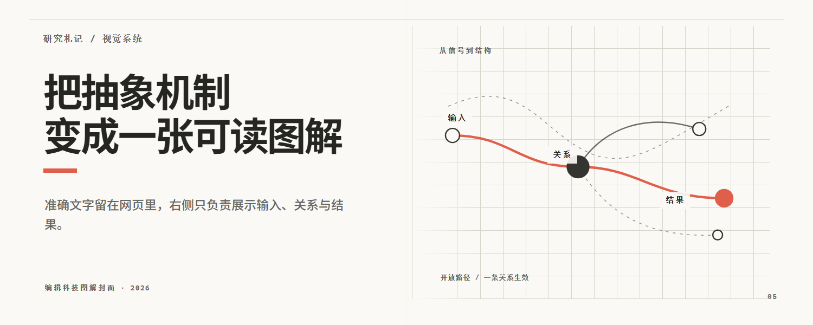
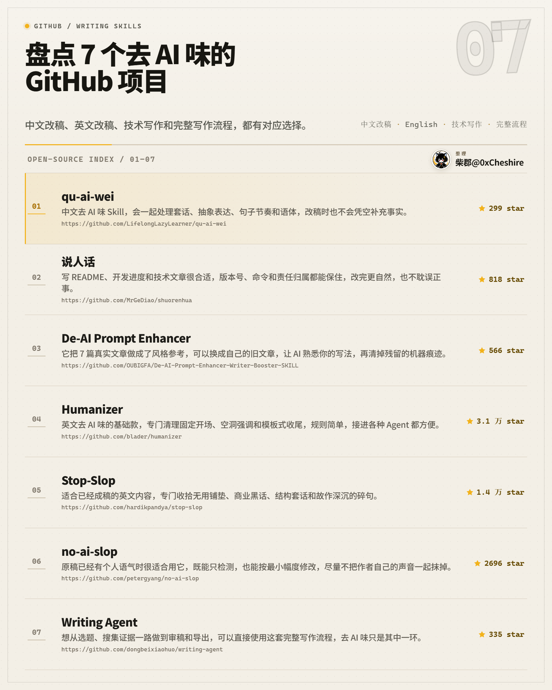
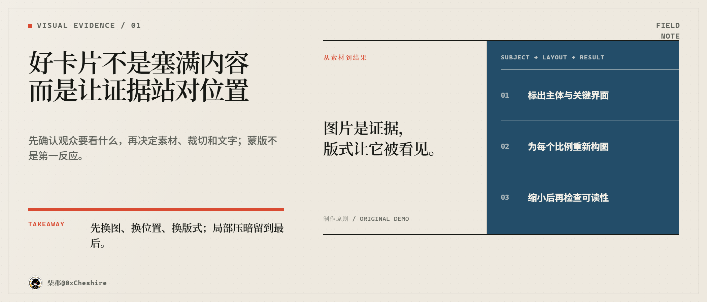
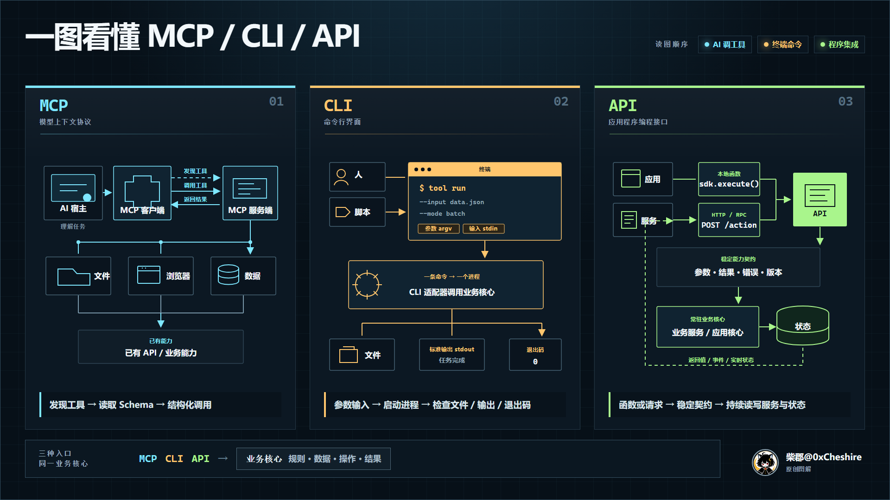
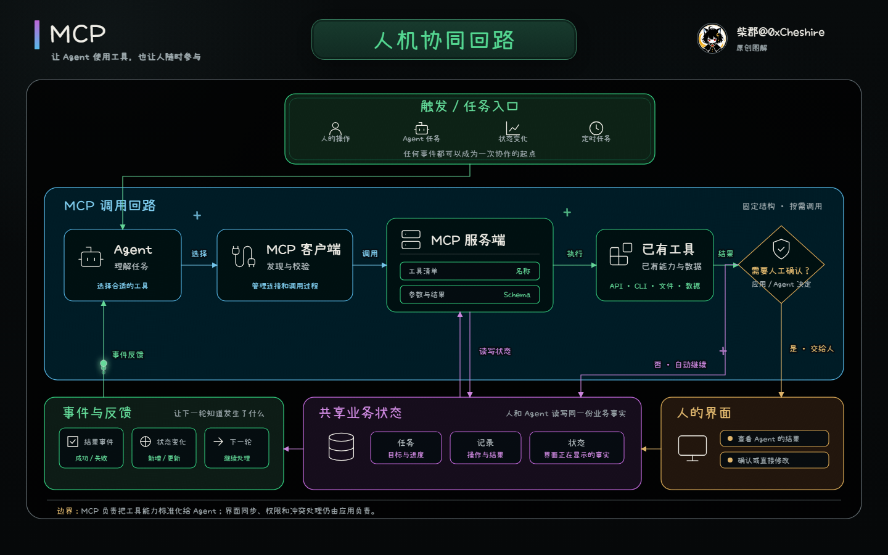

<!-- readme-header:start -->

<p align="center">
  <strong>中文</strong> · <a href="./README.en.md">English</a> · <a href="./README.ja.md">日本語</a> | <a href="./SKILL.md">文档</a> | <a href="./CONTRIBUTING.md">贡献</a> | <a href="https://github.com/CheshireMew/visual-multimedia/issues">反馈</a>
</p>

<p align="center">
  <a href="https://x.com/0xCheshire" title="X"></a>
  <a href="https://t.me/CheshireBTC" title="Telegram"></a>
  <a href="https://blog.blacknico.com/" title="Blog"></a>
  <a href="https://blacknico.com/" title="Homepage"></a>
</p>

<p align="center">
  <a href="https://github.com/CheshireMew/visual-multimedia/stargazers"></a>
  <a href="https://github.com/CheshireMew/visual-multimedia/forks"></a>
  <a href="https://github.com/CheshireMew/visual-multimedia/blob/main/LICENSE"></a>
</p>

<!-- readme-header:end -->

# Visual Multimedia

把已经确认的内容或现有素材交给 Codex，得到可继续修改、可以预览并能按需导出的视觉、视频或音频成品。

Visual Multimedia 是一个媒体制作 Skill。它会先判断内容适合静态卡片、代码动画、视频、音频还是播客，再完成对应的标题、口播、字幕、节目结构和媒体配套文字；进入制作后，它会保留唯一的活动真源，并沿真实的预览、渲染或导出链检查最终结果。



<p align="center"><sub>真实网页案例：内容、构图与可编辑结构来自同一份活动真源，并由浏览器导出预览。</sub></p>

它不会替用户研究主题、筛选长材料中的分享重点或编造事实，也不会默认安装工具、购买素材、上传或发布成品。

如果目标是视频文件，Skill 自带两条产品无关的正式制作链：代码视觉保留 `editable-media` v5 网页包，本地逐帧导出；已有素材、声音和字幕进入 `media-timeline` v1，本地完成可复现时间线与成片。已配置的 [MediaFlow Pro](https://github.com/CheshireMew/MediaFlow-Pro) 能力就绪时优先用它建立原生工程、精调和导出；[HyperFrames](https://github.com/heygen-com/hyperframes) 只在用户明确选择独立网页动画渲染时使用。

## 快速开始

在 Codex 中加载本仓库的 Skill 后，直接点名 `$visual-multimedia`，并提供已经确认的内容或素材、受众和希望得到的结果。例如：

```text
使用 $visual-multimedia，把这篇已经定稿的文章做成三张 3:4 社交卡。
先完成卡片文案和一个构图样稿，确认后再导出 PNG。
```

```text
使用 $visual-multimedia，把这段访谈和现有字幕剪成 90 秒视频。
保留受访者原声，先给我片段选择和旁白方案。
```

```text
使用 $visual-multimedia，把这份确认过的讲解稿做成可手动推进、也能连续导出的多场景 HTML 动画。
```

```text
使用 $visual-multimedia，把这段确认口播做成 16:9 视频。
流程、时间线和因果段落自动选择解释型 B-roll；先确认样稿，再按真实配音时间进入活动时间线并导出。
```

如果只点名 Skill 并提供内容，却没有说明要样稿还是成品，默认流程会推荐一个首选载体、完成可确认的媒体文案，然后停下来等待决定。明确要求样稿或完整制作时，流程才会继续创建网页、处理素材或导出文件。

为了减少来回确认，首次请求最好同时说明：

- 内容真源或素材在哪里，哪些事实和表达已经确认；
- 目标受众看完或听完后应理解什么；
- 想要文案、样稿还是完整成品，以及尺寸、时长或格式要求；
- 哪些图片、录音、视频、品牌资料或参考样本可以使用；
- 是否允许调用外部模型、安装工具、下载素材或执行导出。

## 制作视频时怎样选择执行方

Visual Multimedia 先判断本次活动真源是网页包、可移植时间线、原生编辑器工程还是音频源，再检查当前机器真正可用的能力。选择结果会写入交付合同；一个执行方已经选定后，失败不会触发静默换路。

| 执行方 | 什么时候使用 | 活动真源与交付 |
| --- | --- | --- |
| 本地基础能力 | 没有 MediaFlow Pro，或只需自包含网页、MP4、GIF、现有素材剪辑、声音和字幕 | `editable-media` v5 或 `media-timeline` v1 继续作为可修改真源；Playwright、浏览器、FFmpeg 与 FFprobe 生成成品和回执 |
| [MediaFlow Pro](https://github.com/CheshireMew/MediaFlow-Pro) | 已配置且本轮实际能力检查通过，需要原生工程、桌面精调、多轨制作、版本或交接 | 导入产品无关真源；成功后 `project.mfp` 成为唯一活动时间线，再从同一工程导出 |
| [HyperFrames](https://github.com/heygen-com/hyperframes) | 用户明确选择把独立、无声的代码网页动画确定性渲染为视频 | 读取同一 `editable-media` v5 时间边界；网页包仍是真源，渲染副本只是派生输入 |

如果还没有决定执行方，只需说明最终用途、素材类型和是否需要原生工程，让 Skill 先检查环境并给出首选路径。例如：

```text
使用 $visual-multimedia，把这份已经确认的产品介绍做成 45 秒视频。
先判断网页包还是视频时间线更适合作为真源；MediaFlow Pro 能力就绪时优先使用，否则由本地完整制作链完成。
```

## 可以完成什么

| 需求 | 主要输入 | 可观察结果 |
| --- | --- | --- |
| 社交卡、封面、轮播图、图表 | 已确认内容、尺寸与可用素材 | 可编辑网页真源、逐比例预览和指定图片 |
| 技术机制对比与系统流程图 | 已确认概念、节点关系、参考风格与静态/动态要求 | 可编辑机制图、稳定全貌动画、关键状态检查图和指定图片或视频 |
| GIF、动态图解、代码动画 | 内容关系、语义步骤与播放方式 | 可定位关键状态的网页动画，以及指定 GIF 或视频 |
| 解释型 B-roll 与视频包装 | 确认口播、内容关系、布局比例与真实声音时间 | 自动配方选择、十类可编辑活动模板、活动时间线片段和 PNG/GIF/视频/透明输出 |
| 多场景 HTML 演示 | 完整文案、场景顺序与手动/自动/混合播放要求 | 同一网页真源中的交互演示和连续导出路径 |
| 实拍、访谈、讲课或录屏后期 | 原片、事实转写、片段范围与交付要求 | 可继续修改的时间线、字幕、混音和经过审阅的成片 |
| 音频与播客 | 录音、节目结构、旁白与声音要求 | 音频时间线、混音成品和必要附属文件 |
| 参考视频复刻或对齐 | 准确参考区间、目标素材与还原层级 | 分开的精确回放或参数化重建结果，以及逐帧与人工观看证据 |
| 二次元口播角色 | 已注册角色，或确认的角色母版与校准视频；真实语音 | 版本化角色资源、已复核时间轴和完整人物口播轨或固定角色窗 |
| 采访原声讲解型视频 | 已选原声片段、事实转写、背景与解释文案 | 保留来源时间码的“背景—原声—解释—总结”成片与交付报告 |
| 媒体文案与口播参考库 | 已确认主张、作者声音，或明确的参考库维护请求 | 可直接制作的活动文案，或 Skill 外部的可定位参考库 |

具体任务只加载需要的制作方法。入口、适用条件和停止位置以 [SKILL.md](SKILL.md) 为准。

### 真实输出示例

<table>
  <tr>
    <td width="50%" valign="top">
      
      <br><sub>社交卡：适合纵向阅读的暖纸风格项目列表。</sub>
    </td>
    <td width="50%" valign="top">
      
      <br><sub>多比例变体：同一结构化内容可以重排为宽屏画面。</sub>
    </td>
  </tr>
</table>

<table>
  <tr>
    <td width="50%" valign="top">
      
      <br><sub>技术机制对比：每栏用微型流程图解释工作方式，并落到产品无关的共享能力。</sub>
    </td>
    <td width="50%" valign="top">
      
      <br><sub>稳定全貌动态图：结构从第一帧保持不变，路径同色光点按语义事件依次移动；目录内同时提供可编辑网页和移动端 MP4。</sub>
    </td>
  </tr>
</table>

## 制作原则

1. **先确认内容，再选择载体。** 内容真源决定主张和边界，视觉与声音只负责降低理解成本、建立节奏和增强体验。
2. **先写媒体文案，再做画面和声音。** 用户已经确认完整文案时不擅自重写，只做载体需要的确定性拆分。
3. **在最早未确认的层面做样稿。** 文案、风格、构图、动效和声音样稿各自只验证一个层面；确认后再扩展完整成品。
4. **每类成品只保留一个活动制作入口。** 网页视觉以网页包为真源，视频和音频以各自时间线为真源，混合项目不在后期工具中重画网页负责的内容。
5. **正式交付必须经过真实消费者。** 源文件能打开、脚本返回成功或 schema 通过都不等于成品可用；最终文件还要由真实浏览器、播放器、编辑器或导出链读取和检查。

## 可编辑网页与媒体合同

代码生成的卡片、图表和动画从 [assets/web-media-starter](assets/web-media-starter) 建立自包含网页包。`schemas/editable-media.v5.schema.json` 是网页清单的唯一结构真源；运行时同时暴露 `window.editableMedia` 编辑状态接口和 `window.__hf.duration/seek(seconds)` 确定性时间接口。本地渲染器、结构化编辑器和 HyperFrames 都读取这一个边界。

图片、视频、音频和生成素材先进入带文件哈希、来源、权利、原片与代理关系的素材账本，再由网页、视频时间线或音频项目显式采用。`schemas/media-timeline.v1.schema.json` 定义本地与外部编辑器都能理解的可移植时间线，`schemas/media-delivery.v3.schema.json` 把实际提供方、真源文件、回执和 SHA-256 绑定到最终输出。导出的 PNG、GIF、MP4 或音频文件是派生结果，不会成为第二个编辑入口。

## 不适用的任务

- 通读课程、书籍或长材料后判断什么值得分享；
- 主动研究主题、补充事实、撰写长文或 Newsletter；
- 只交付能够脱离媒体独立成立的短帖或 Thread；
- 规划现场拍摄、器材、人员和拍摄日程；
- 创建或编辑 PPTX、Keynote 等幻灯片文件；
- 账号运营、排期、上传、发送或发布。

这些任务可以由其它能力先产出内容真源或完成后续发布，再把已经确认的材料交给本 Skill 制作媒体。

## 仓库结构

| 路径 | 职责 |
| --- | --- |
| [SKILL.md](SKILL.md) | Skill 的适用边界、默认流程、任务路由和交付标准 |
| [references](references) | 按具体媒体任务加载的制作方法 |
| [assets](assets) | 网页 starter、真实合同案例、制作配方和可复用资源 |
| [schemas](schemas) | 媒体项目、素材、审阅、角色和网页包的结构合同 |
| [scripts](scripts) | 导入、校验、规划、渲染、审阅与交付工具 |
| [agents/openai.yaml](agents/openai.yaml) | Codex 中的展示名称、简介和默认提示词 |
| [.project-steward/project.json](.project-steward/project.json) | 本仓库采用的项目治理基线与版本 |

`archive/` 只保存已退出路线和迁移证据，不是正常任务入口。活动流程不得从归档中恢复旧协议或旧 helper。

## 维护与验证

仓库级检查按实际改动分为三档；不带参数时等同于 `--fast`：

```powershell
node scripts/check-skill.mjs --fast
node scripts/check-skill.mjs --browser
node scripts/check-skill.mjs --full
```

`--fast` 检查 Skill、README、许可证、schema、资源索引、真实案例静态合同与脚本语法；`--browser` 在此基础上验证 Playwright 网页包、确定性时间、十类解释型 B-roll、文字动效、本地网页视频和产品功能宣传片链路；`--full` 再验证导演自动选模板、真实时间投影、可移植时间线、提供方路由、五种 B-roll 导出及其它 Node、Python 生产消费与最终交付回归。Python 不在系统命令路径中时，可以通过 `VISUAL_MULTIMEDIA_PYTHON` 指向实际解释器。

涉及 `editable-media`、网页 starter、素材表示、确定性时间边界或 MediaFlow Pro 公开消费合同的改动，需要同时沿生产者、同步边界、MediaFlow Pro 消费者和最终可见结果完成迁移。准确的联动范围与验证命令见 [AGENTS.md](AGENTS.md)；公开编辑器能力的实际入口见 [references/structured-media-editor-cli.md](references/structured-media-editor-cli.md)。

本仓库的项目事实以活动源码、配置、schema、资源和测试为准。Project Steward 配置只记录采用的治理基线，不复制业务合同。

## Star History

<picture>
  <source media="(prefers-color-scheme: dark)" srcset="https://raw.githubusercontent.com/CheshireMew/visual-multimedia/star-history/star-history-dark.svg">
  <source media="(prefers-color-scheme: light)" srcset="https://raw.githubusercontent.com/CheshireMew/visual-multimedia/star-history/star-history.svg">
  
</picture>

## 许可证

本仓库的原创源码、Skill、脚本、Schema、模板与文档采用 [Mozilla Public License 2.0](LICENSE)。个人头像、角色、品牌资料，以及项目拥有或在项目内生成的图片、音频、视频、渲染结果和预览媒体不随 MPL-2.0 授权，并依照 [ASSET-LICENSE](ASSET-LICENSE) 保留全部权利。第三方内容继续遵守各自的许可证与声明。

准确的路径范围、排除项和第三方覆盖关系以 [LICENSING.md](LICENSING.md) 为唯一说明。

## 第三方资源与致谢

本仓库直接改编并随 Skill 分发的第三方资源如下。这里只列实际进入成品链或活动资源的内容；只学习通用方法并完全独立实现、没有复制来源 IP、示例、资源或代码的研究材料，不会被写成项目依赖。

- [Vincentwei1021/video-shotcraft](https://github.com/Vincentwei1021/video-shotcraft)：`assets/shot-recipe-library/recipes/` 中 104 张镜头卡与 161 个风格变体的语义资料由原仓库改写而来，采用 Apache-2.0，Copyright 2026 Wei Yihao。本仓库没有复制上游 Remotion TSX、产品截图、音频、动态预览 MP4 或 Gallery 实现；准确范围、修改说明与完整许可证见 [shot recipe notices](assets/shot-recipe-library/THIRD_PARTY_NOTICES.md)。
- `sakura-animate-text`：`assets/text-motion-library/text-motion-runtime.js` 的文字动效家族基于该项目确定性重写，采用 MIT License，Copyright 2026 Sakura；没有复制上游 WAAPI 播放循环、随机延迟、CDN 加载器、框架适配、示例文案、字体或站点视觉。完整声明见 [text motion notices](assets/text-motion-library/THIRD_PARTY_NOTICES.md)。
- [Xiaolai（小赖字体）](https://github.com/lxgw/kose-font)：`assets/web-card-cases/handdrawn-system-collaboration-flow/assets/fonts/Xiaolai-Regular.ttf` 用于真实手绘中文案例，采用 SIL Open Font License 1.1；完整许可证随字体保存在案例目录。
- [Lucide](https://github.com/lucide-icons/lucide)：同一手绘案例在 `index.html` 中内嵌 Lucide Static 1.28.0 的线性图标路径；Lucide 自有图标采用 ISC，Server、Monitor、Database 等 Feather 派生图标同时保留 Cole Bemis 的 MIT 条款。准确范围与完整许可证见 [case notices](assets/web-card-cases/handdrawn-system-collaboration-flow/THIRD_PARTY_NOTICES.md)。
